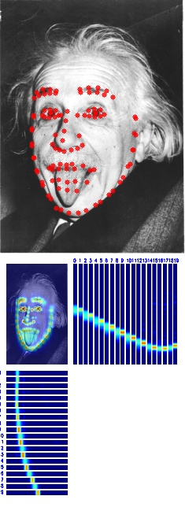
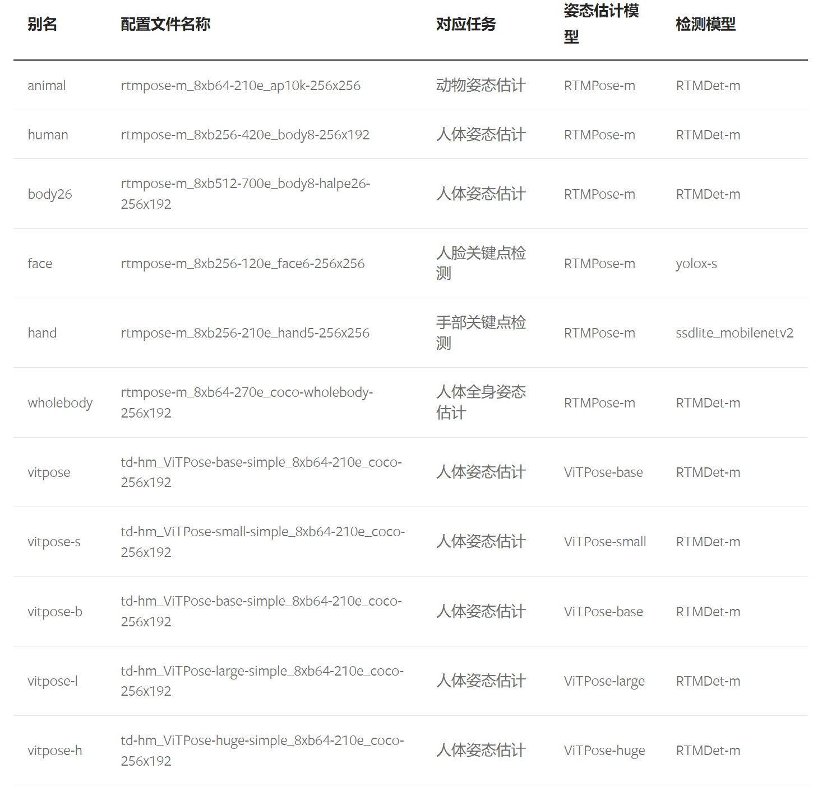

## Face Keypoint Estimation

本节我们继续演示如何使用 demo 脚本进行 2D 脸部关键点的识别。同样的，用户仍要确保开发环境已经安装了 3.0 版本以上的 [MMdetection](https://github.com/open-mmlab/mmdetection) 。

我们在 [mmdet model zoo](https://github.com/open-mmlab/mmpose/tree/dev-1.x/demo/docs/zh_cn/mmdet_modelzoo.md#脸部-bounding-box-检测模型) 提供了一个预训练好的脸部 Bounding Box 预测模型，用户可以前往下载。

### 2D 脸部图片关键点识别推理

```
python demo/topdown_demo_with_mmdet.py \
    ${MMDET_CONFIG_FILE} ${MMDET_CHECKPOINT_FILE} \
    ${MMPOSE_CONFIG_FILE} ${MMPOSE_CHECKPOINT_FILE} \
    --input ${INPUT_PATH} [--output-root ${OUTPUT_DIR}] \
    [--show] [--device ${GPU_ID or CPU}] [--save-predictions] \
    [--draw-heatmap ${DRAW_HEATMAP}] [--radius ${KPT_RADIUS}] \
    [--kpt-thr ${KPT_SCORE_THR}] [--bbox-thr ${BBOX_SCORE_THR}]
```


用户可以在 [model zoo](https://mmpose.readthedocs.io/en/dev-1.x/model_zoo/face_2d_keypoint.html) 获取预训练好的脸部关键点识别模型。

这里我们用 [face6 model](https://download.openmmlab.com/mmpose/face/hrnetv2/hrnetv2_w18_aflw_256x256-f2bbc62b_20210125.pth) 来进行演示：

```
python demo/topdown_demo_with_mmdet.py \
    demo/mmdetection_cfg/yolox-s_8xb8-300e_coco-face.py \
    https://download.openmmlab.com/mmpose/mmdet_pretrained/yolo-x_8xb8-300e_coco-face_13274d7c.pth \
    configs/face_2d_keypoint/rtmpose/face6/rtmpose-m_8xb256-120e_face6-256x256.py \
    https://download.openmmlab.com/mmpose/v1/projects/rtmposev1/rtmpose-m_simcc-face6_pt-in1k_120e-256x256-72a37400_20230529.pth \
    --input tests/data/cofw/001766.jpg \
    --show --draw-heatmap
```


可视化结果如下图所示：



如果使用了 heatmap-based 模型同时设置了 `--draw-heatmap` ，预测的热图也会跟随关键点一同可视化出来。

如果想本地保存可视化结果可使用如下命令：

```
python demo/topdown_demo_with_mmdet.py \
    demo/mmdetection_cfg/yolox-s_8xb8-300e_coco-face.py \
    https://download.openmmlab.com/mmpose/mmdet_pretrained/yolo-x_8xb8-300e_coco-face_13274d7c.pth \
    configs/face_2d_keypoint/rtmpose/face6/rtmpose-m_8xb256-120e_face6-256x256.py \
    https://download.openmmlab.com/mmpose/v1/projects/rtmposev1/rtmpose-m_simcc-face6_pt-in1k_120e-256x256-72a37400_20230529.pth \
    --input tests/data/cofw/001766.jpg \
    --draw-heatmap --output-root vis_results
```


### 2D 脸部视频关键点识别推理

视频和图片使用了同样的接口，区别在于视频推理时 `${INPUT_PATH}` 既可以是本地视频文件的路径也可以是视频文件的 **URL** 地址。

```
python demo/topdown_demo_with_mmdet.py demo/mmdetection_cfg/yolox-s_8xb8-300e_coco-face.py https://download.openmmlab.com/mmpose/mmdet_pretrained/yolo-x_8xb8-300e_coco-face_13274d7c.pth configs/face_2d_keypoint/rtmpose/face6/rtmpose-m_8xb256-120e_face6-256x256.py https://download.openmmlab.com/mmpose/v1/projects/rtmposev1/rtmpose-m_simcc-face6_pt-in1k_120e-256x256-72a37400_20230529.pth --input webcam --show  --output-root vis_results --radius 1
```


### 使用 Inferencer 进行 2D 脸部关键点识别推理

Inferencer 提供一个更便捷的推理接口，使得用户可以绕过模型的配置文件和 checkpoint 路径直接使用 model aliases ，支持包括图片路径、视频路径、图片文件夹路径和 webcams 在内的多种输入方式，例如可以这样使用：

```
python demo/inferencer_demo.py tests/data/wflw \
    --pose2d face --vis-out-dir vis_results/wflw --radius 1
```


该命令会对输入的 `tests/data/wflw` 下所有的图片进行推理并且把可视化结果都存入 `vis_results/wflw` 文件夹下。

 

除此之外， Inferencer 也支持保存预测的姿态结果。具体信息可在 [Inferencer 文档](https://mmpose.readthedocs.io/en/dev-1.x/user_guides/inference.html#inferencer-a-unified-inference-interface) 查看。

### 加速推理

对于 2D 脸部关键点预测模型，用户可以通过修改配置文件中的 `model.test_cfg.flip_test=False` 来加速，例如 aflw_hrnetv2 中的第 90 行。

### 2D 脸部摄像头关键点识别推理

视频和图片使用了同样的接口，区别在于视频推理时 `${INPUT_PATH}` 既可以是本地视频文件的路径也可以是视频文件的 **URL** 地址。

```
python demo/topdown_demo_with_mmdet.py demo/mmdetection_cfg/yolox-s_8xb8-300e_coco-face.py https://download.openmmlab.com/mmpose/mmdet_pretrained/yolo-x_8xb8-300e_coco-face_13274d7c.pth configs/face_2d_keypoint/rtmpose/face6/rtmpose-m_8xb256-120e_face6-256x256.py https://download.openmmlab.com/mmpose/v1/projects/rtmposev1/rtmpose-m_simcc-face6_pt-in1k_120e-256x256-72a37400_20230529.pth --input webcam --show  --output-root vis_results --radius 1
```


## 摄像头推理

从版本 v1.1.0 开始，原来的摄像头 API 已被弃用。用户现在可以选择使用推理器（Inferencer）或 Demo 脚本从摄像头读取的视频中进行姿势估计。


Demos — MMPose 1.2.0 文档
[Demos — MMPose 1.2.0 文档](https://mmpose.readthedocs.io/zh-cn/dev-1.x/demos.html#id21)

### 使用推理器进行摄像头推理

用户可以通过执行以下命令来利用 MMPose Inferencer 对摄像头输入进行人体姿势估计：
human
```bash
python demo/inferencer_demo.py webcam --pose2d 'human'
```

body26
```bash
python demo/inferencer_demo.py webcam --pose2d 'body26'
```

face
```bash
python demo/inferencer_demo.py webcam --pose2d 'face'
```

hand
```bash
python demo/inferencer_demo.py webcam --pose2d 'hand'
```

wholebody
```bash
python demo/inferencer_demo.py webcam --pose2d 'wholebody'
```

vitpose
```bash
python demo/inferencer_demo.py webcam --pose2d 'vitpose'
```

vitpose-s
```bash
python demo/inferencer_demo.py webcam --pose2d 'vitpose-s'
```

vitpose-b
```bash
python demo/inferencer_demo.py webcam --pose2d 'vitpose-b'
```

vitpose-l
```bash
python demo/inferencer_demo.py webcam --pose2d 'vitpose-l'
```

vitpose-h
```bash
python demo/inferencer_demo.py webcam --pose2d 'vitpose-h'
```

### 使用 Demo 脚本进行摄像头推理

除了 `demo/image_demo.py` 之外，所有的 Demo 脚本都支持摄像头输入。

以 `demo/topdown_demo_with_mmdet.py` 为例，用户可以通过在命令中指定 **`--input webcam`** 来使用该脚本对摄像头输入进行推理：

```bash
# inference with webcam
python demo/topdown_demo_with_mmdet.py projects/rtmpose/rtmdet/person/rtmdet_nano_320-8xb32_coco-person.py https://download.openmmlab.com/mmpose/v1/projects/rtmpose/rtmdet_nano_8xb32-100e_coco-obj365-person-05d8511e.pth projects/rtmpose/rtmpose/body_2d_keypoint/rtmpose-m_8xb256-420e_coco-256x192.py https://download.openmmlab.com/mmpose/v1/projects/rtmposev1/rtmpose-m_simcc-aic-coco_pt-aic-coco_420e-256x192-63eb25f7_20230126.pth --input webcam --show
```


使用现有模型进行推理 — MMPose 1.2.0 文档
[使用现有模型进行推理 — MMPose 1.2.0 文档](https://mmpose.readthedocs.io/zh-cn/dev-1.x/user_guides/inference.html)

